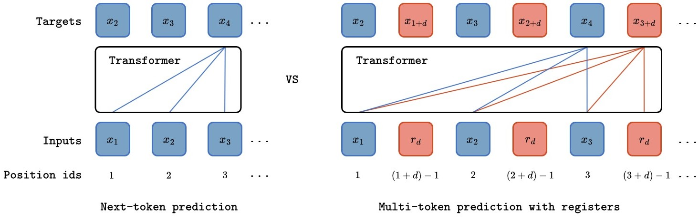

<div align="center">
<h1>Multi-Token Prediction Needs Registers</h1>
<h2> ⭐ NeurIPS 2025 POSTER ⭐ </h2>
**Anastasios Gerontopoulos<sup>1,3</sup>, Spyros Gidaris<sup>2</sup>, Nikos Komodakis<sup>1,3,4</sup>**

<sup>1</sup>Archimedes/Athena RC &emsp; <sup>2</sup>valeo.ai  &emsp;
<sup>3</sup>University of Crete &emsp;  <sup>4</sup>IACM-Forth &emsp;

[](https://arxiv.org/abs/2505.10518)
[](https://opensource.org/licenses/MIT)

</div>



<br>

This repository contains the official implementation of the paper: **Multi-Token Prediction Needs Registers**. 

<br>

<b>TL;DR</b>: We propose **MuToR**, a simple and effective approach that leverages register tokens to predict future targets and enrich supervision for autoregressive transformers. Our method introduces only a negligible number of additional parameters and requires no architectural changes—ensuring compatibility with off-the-shelf pretrained language models.

## News
- \[2025/9/18\]  MuToR was accepted in NeurIPS 2025 !
- \[2025/9/1\]   We release the code for finetuning pretrained LMs on downstream tasks
- \[2025/5/15\]  Paper appears on arXiv

## Getting started
We provide the [checkpoints](https://huggingface.co/nasos10/models) from the paper via **HuggingFace**. They can be loaded in our evaluation script to reproduce our results.

## Finetune Pretrained LLMs with MuToR
We provide our code to finetune pretrained LLMs on downstream tasks.
Checkout our relevant [guidelines](language_modeling/mutor_lm_doc.md) for more details on setting up the environment and running experiments.

## MuToR for autoregressive image generation.
We also plan to open-source our code for **MuToR-2D**, stay tuned!

## Citation
If you use our code, or if find this work useful in your research, please consider citing:

```bibtex
@article{gerontopoulos2025multi,
  title={Multi-Token Prediction Needs Registers},
  author={Gerontopoulos, Anastasios and Gidaris, Spyros and Komodakis, Nikos},
  journal={arXiv preprint arXiv:2505.10518},
  year={2025}
}
```
